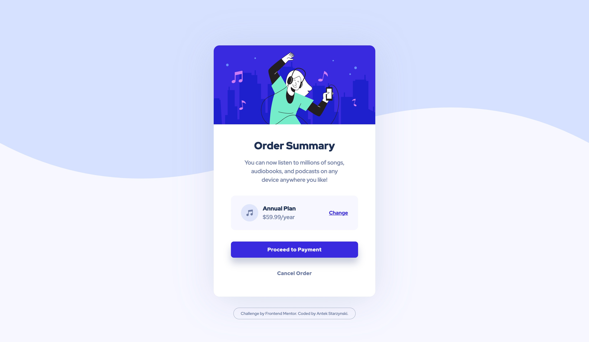

# Frontend Mentor - Order summary card solution

This is a solution to the [Order summary card challenge on Frontend Mentor](https://www.frontendmentor.io/challenges/order-summary-component-QlPmajDUj). Frontend Mentor challenges help you improve your coding skills by building realistic projects. 

### Screenshot

### Links

- Solution URL: [see solution](https://github.com/antonistarzynski/order-summary-componenet-main)
- Live Site URL: [see live site URL](https://antonistarzynski.github.io/order-summary-componenet-main/)

### Built with

- Semantic HTML5 markup
- CSS custom properties
- Flexbox

